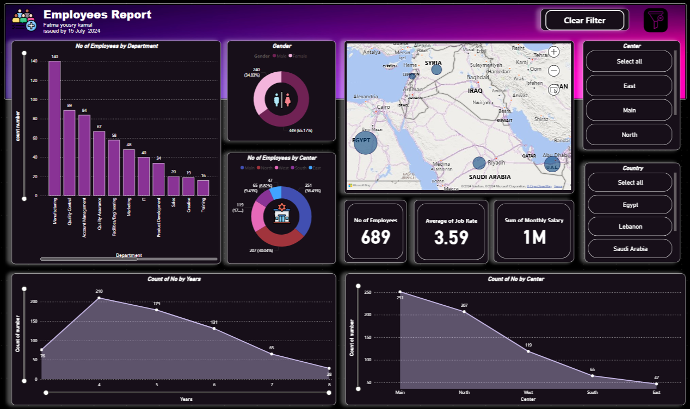

# Employees Report using Power BI

This project presents an **Employees Report** developed using **Power BI**. The report provides insightful analytics and visualizations related to employee demographics, salaries, and job rates, helping organizations make data-driven decisions.

## Table of Contents
- [Introduction](#introduction)
- [Features](#features)
- [Technologies Used](#technologies-used)
- [Dataset](#dataset)
- [Getting Started](#getting-started)
- [Report Sections](#report-sections)
- [Visualization](#visualization)
- [License](#license)

## Introduction
The **Employees Report** is designed to analyze key employee metrics such as department distribution, salary insights, and job tenure. It offers a detailed view of employee demographics and provides interactive filtering options to explore the data dynamically.

## Features
- **Employee Distribution by Department**: Shows the number of employees in each department.
- **Gender Distribution**: Provides insights into the gender ratio across the organization.
- **Employee Center and Location**: Maps employees to various geographical centers.
- **Employee Tenure**: Visualizes the distribution of employees by years of service.
- **Job Rate Analysis**: Tracks the average job rate across the organization.
- **Salary Summary**: Displays the total monthly salary and other salary-related data.

## Technologies Used
- **Power BI**: The primary tool used for data visualization and reporting.
- **Dataset**: Excel file containing information about employees, their salaries, and work details.

## Dataset
The dataset used in this report contains the following fields:

- **Numbers**: Unique identifier for each employee.
- **First Name**: Employee's first name.
- **Last Name**: Employee's last name.
- **Gender**: Employee gender (Male, Female, Other).
- **Start Date**: Date when the employee started.
- **Years**: Number of years the employee has worked.
- **Department**: Department where the employee works.
- **Country**: Employee's country of residence.
- **Center**: The work center to which the employee is assigned.
- **Monthly Salary**: The employee's monthly salary.
- **Job Rate**: The employee's job performance rate.      |

You can replace the dataset with your own by uploading it to Power BI.

## Getting Started
To view or modify the report, follow these steps:

1. **Install Power BI Desktop**: Download Power BI Desktop from [Microsoft's official website](https://powerbi.microsoft.com/desktop/).
2. **Download Report**: Clone or download this repository and open the `employees_report.pbix` file in Power BI Desktop.
3. **Load Your Data**: Ensure your dataset is structured according to the description above, and update the data source in Power BI by navigating to the `Transform Data` section.

## Report Sections
1. **No of Employees by Department**: Displays the distribution of employees across various departments, with Manufacturing having the highest number of employees.
2. **Gender Distribution**: A breakdown of employees by gender, showing 65.17% male and 34.83% female.
3. **No of Employees by Center**: Represents employee count by center, with the Main center having the majority of employees.
4. **Map of Employees by Country**: Geographical distribution of employees across Egypt, Lebanon, and Saudi Arabia.
5. **Key Metrics**:
   - Total number of employees: 689
   - Average job rate: 3.59
   - Sum of monthly salary: 1M
6. **Count of Employees by Years**: Visualizes employee tenure over the years, highlighting a decreasing trend.
7. **Count of Employees by Center**: Shows employee distribution by different centers across regions.

## Visualization
Below is a placeholder for the Employees Report visualization:

